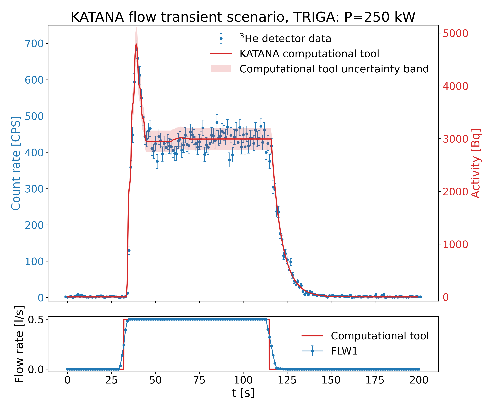

# KATANA computational tool

Using Python to predict the activity inside the measurement snail in the KATANA water activation experiment. 
Reaction rates in irradiation volume calculated with MCNP.

The KATANA computational tool models the water activation loop using a conventional analytical approach, divided into four sections: the irradiation region (inner irradiation Snail), the observation region (outer Snail No. 1), and two transport regions (pipes and pump). The circuit is discretised into uniform volume elements of 21.65 cm $^3$, which are sequentially transported through the simulated loop. For each time step $\Delta t$, the specific activity of a given isotope in each volume element is updated according to

$A'_{t+\Delta t} = A'_t\ e^{-\lambda \Delta t} + R(1-e^{-\lambda \Delta t})$,

where $A'_t$ is the isotope-specific activity at time $t$, $\lambda$ is the decay constant, and $R$ is the average reaction rate within the region of interest. The latter is defined as  

$R = C \int \Phi(E)\,\sigma(E) N dE$.

Here, $\Phi(E)$ denotes the neutron flux, $\sigma(E)$ the microscopic cross section, and $N$ the atomic number density of the parent nuclide, calculated using the JSI TRIGA MCNP model [1]. The transport of each volume element proceeds in discrete steps determined by the volumetric flow rate.

The computational tool is implemented in the Python programming language and can model a wide range of irradiation scenarios and loop geometries. Two main loop configurations are available: the short loop, optimized for radionuclides with short half-lives (N-16 and N-17), and the decay loop, which enables measurements of longer-lived activation products (O-19). In addition, the tool allows simulation of both flow transients and reactor power transients, providing flexibility for benchmarking experiments and validation studies under real experimental conditions.

Uncertainties in the KATANA computational tool are evaluated by combining contributions from nuclear data uncertainties, statistical uncertainties from Monte Carlo transport calculations, and the averaging of reaction rates across the irradiation volume. 

## KATANA water activation facility

The KATANA water activation facility was commissioned in the "Jožef Stefan" Institute TRIGA (JSI TRIGA) research reactor hall in late 2023. In 2024 and 2025, five intensive experimental campaigns were conducted at the KATANA facility as part of the EUROFusion work package Preparation of ITER Operation (WPPrIO), aimed at addressing the key challenges of water activation in future fusion reactors. More than 20 researchers from eight research groups participated in the campaigns, illustrating the collaborative nature of this ambitious project. Over 26 test days, the JSI TRIGA reactor operated for more than 200 hours and provided the necessary platform for a variety of tests and measurements.

The KATANA water activation facility provides a controlled source of high-energy $\gamma$-rays and neutrons in the range 0.3–1.2 MeV. It was developed to enable experimental investigations of water activation phenomena and is designed for flexibility, allowing applications such as calibration of radiation detectors and dosimeters, shielding studies, validation of simulation tools for fusion cooling systems, and measurements of integral cross sections [1].

The facility comprises a closed water activation loop divided into three main components: the inner section, the outer section, and the control panel. The inner section is installed in the Radial Piercing Port (RPP) of the JSI TRIGA reactor, where neutron interactions generate short-lived radioisotopes in the water. The activated water then circulates through pipes to the outer section, located inside the concrete shielding adjacent to the RPP. This outer section consists of two circuits connected by a three-way valve: a short primary loop and a longer delay loop. For the experiments described in this work, only the primary loop was used, as the radionuclide of interest has a short half-life. The activated water is continuously monitored in the measurement volume before being recirculated into the inner section. The system is operated and controlled remotely from the control panel positioned behind the concrete shielding [1,2,3].

## Validation

The experiments with neutrons from the decay of $^{17}$ N were conducted on October 3, 2025 with reactor core configuration no. 262, and the reactor operating at full power in steady state. During the experiments, a single $^{3}$ He detector with a CAEN data acquisition system was used, positioned inside the outer measurement volume, as shown in Figure below. The KATANA water activation facility was operated in the primary closed water loop configuration (short loop).

## References

[1] [D. Kotnik, J. Peric, D. Govekar, L. Snoj, and I. Lengar. “KATANA - water activation facility at JSI
TRIGA, Part I: Final design and activity calculations.” Nuclear Engineering and Technology (2024).](https://doi.org/10.1016/j.net.2024.09.036)

[2] [D. Kotnik, J. Peric, D. Govekar, L. Snoj, and I. Lengar. “KATANA - water activation facility at JSI
TRIGA, Part II: First experiments." Nuclear Engineering and Technology (2024).](https://doi.org/10.1016/j.net.2024.10.052)

[3] [J. Peric, D. Kotnik, L. Snoj, and V. Radulovi´c. “Neutron emission from water activation: Experiments and modeling under fusion-relevant conditions at the KATANA facility.” Fusion Engineering and Design, volume 216, p. 115052 (2025).](https://doi.org/10.1016/j.fusengdes.2025.115052)
  

  
