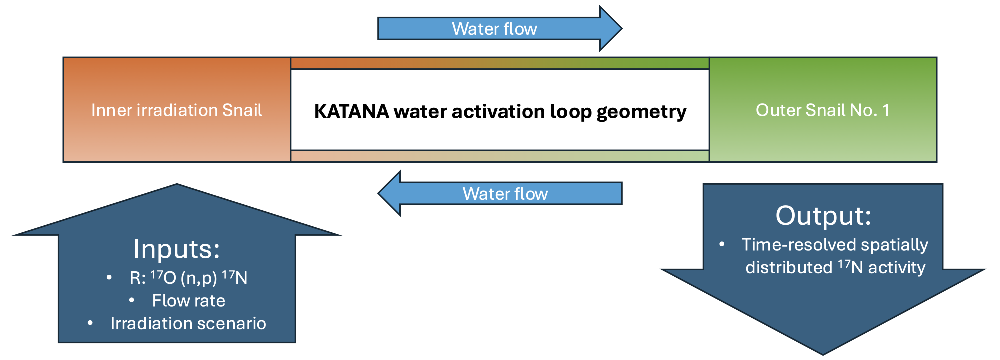

# Water activation activity modeling

Using Python to predict the activity inside the measurement snail in the KATANA water activation experiment. 
Reaction rates in irradiation volume calculated with MCNP.

- Activity versus time (24_11_15_irradiation_scenario_pulse_model_V1_test.py)
  

  
